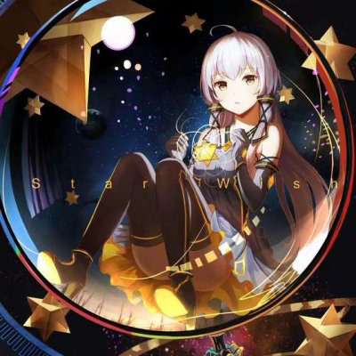

## super-easy-super-resolution
- 😊 a super easy and small project to realise super resolution (real-esr)
- ☕ just clone & pip install some libs in common use, then you can run ! 

👌 Super easy install

```bash
$ git clone https://github.com/LSTM-Kirigaya/super-easy-super-resolution
$ pip install opencv-python numpy pillow torch colorama
```

🙌 Super easy usage

```bash
$ python real-esrgan.py -i image/test.jpg -o test.sr.jpg
```

😎 Compare reconstruction quality

|   test.jpg    |   test.sr.jpg    |
|:------------:|:------------:|
|    |    |